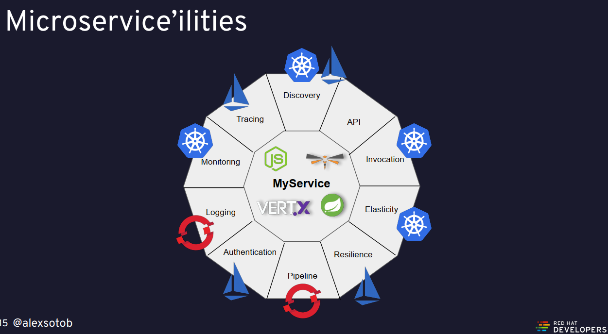
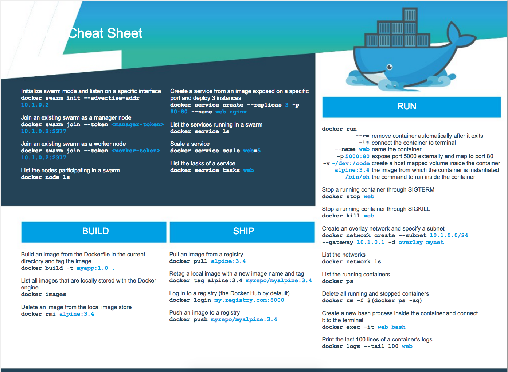

# KUBERNETES, OPENSHIFT, ISTIO



# DOCKER

## Comandos básicos

### Versión
```
docker version
```
### Bash interactivo
```
docker run --interactive --tty centos bash
```
### Correr máquina
```
--run nginx
docker run --detach --publish 80:80 --name webserver nginx
```
### Parar máquina
```
--stop webserver
 docker container stop webserver
```
###  Descargar imagen
 ```
--descargar imagen ver hub https://hub.docker.com/	
docker pull sonarqube
 ```
### Ver imagenes descargadas
```
--ver imagenes 
docker images
--ver imagenes independientemente del estado
docker ps -a
```
### Levantar imagenes
```
docker run -d --name sonarqube -p 9000:9000 -p 9092:9092 sonarqube
docker run -d --name sonarqube -p 9000:9000 sonarqube
```
### Parar
```
docker stop sonarqube
```
### Conocer las IPS de las máquinas levantadas
```
docker inspect -f '{{.Name}} - {{.NetworkSettings.IPAddress }}' $(docker ps -aq)
```
### Eliminar contenedor
```
docker ps -a
docker rm ID_or_Name
--lo borra aunque esté corriendo
docker rm -fv ID_or_Name
```
### Eliminar imagen
```
docker ps
docker rmi ID_or_Name
```
### Crear red 
```
docker network create --driver=bridge --subnet=10.228.51.0/16 --ip-range=10.228.51.0/16 --gateway=10.228.51.254 app-network
```
### Importar máquina

```
docker load -i jbosseap63_centos7.tar
```
### Ejecutar maquina mapeo de carpetas
```
docker run --rm --name user-postgresdb-container -e -d -p 5432:5432 -v $HOME/docker/volumes/postgres:/var/lib/postgresql/data josecarloslopez/postgres-user:1.0

docker run -d -v <ruta_local_despliegue>:/opt/jboss/jboss-eap-6.3/standalone/deployments -v <ruta_local_logs>:/var/log/jboss -i -t -p8081:8080 --name jbosseap1  jbosseap63:centos7 bash
```

### Otros
```
docker ps -a -q --filter "name=container_name" --format="{{.ID}}" | ForEach-Object -Process {docker rm $_ -f}
docker build -t myapp:1.0. --Build an image from the Dockerfile in the current directory and tag the image
docker images -- List all images that are locally stored with the Docker engine
docker pull alpine:3.4 --Pull an image from a registry
docker push myrepo/myalpine:3.4 --Push an image to a registry
docker login -- Log in to a registry (the Docker Hub, bydefault)

docker run --rm -it -p 5000:80 -v /dev/code alpine:3.4 /bin/sh
Run a docker container
--rm: Remove container automatically after it exits
-it: Connect the container to the Terminal
-p: Expose port 5000 externally and map to port 80/dev/code alpine:3.4 /bin/sh
-v: Create a host mapped volume inside the container The image from which the container is instantiated
/bin/sh: The command to run inside the container

docker stop myApp --Stop a running container
docker ps --List the running containers
docker rm -f $(docker ps -aq) --Delete all running and stopped containers
docker exec -it --web bash Create a new bash process inside the container and connect it to the Terminal
docker logs --tail 100 web --Print the last 100 lines of a container's logs
docker-compose up --Start the services defined in the dockercompose.yml file in the current folder
docker-compose down --Stop the services defined in the docker-compose.yml file in the current folder
```
### Conectar por ssh a maquina
Use docker ps to get the name of the existing container
Use the command docker exec -it <container name> /bin/bash to get a bash shell in the container
Generically, use docker exec -it <container name> <command> to execute whatever command you specify in the container.

### Stop all containers (powershell)
```
docker ps -q | % { docker stop $_ }
```
### Listar
```
docker images --format "table {{.Repository}}\t{{.Tag}}\t{{.ID}}"
docker ps --format "table {{.Image}}\t{{.Ports}} \t{{.Names}}"
```


